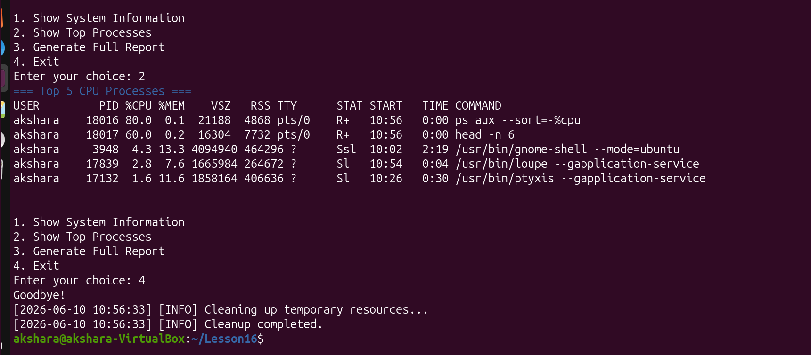

# Personal System Monitor and Reporter Tool

A Clean and professional Bash Script that monitors Linux system resources and generates detailed reports.

Built as a capstone project during my *Linux Command Line and Bash Scripting* learning Journey.

Features:
- Interactive Menu Modes -> Easy to use for daily monitoring 
- Direct/Command Mode -> For automation ('-o' , '-v')
- Beautiful colored terminal output 
- Timestamped logging 
- Automatic cleanup ( even on Ctrl+C )
- Generates timestamped system reports 

#Demo / Screenshots 

### 1. Interactive Menu + System Information 


### 2. Top Processes + Report Generation 


#Usage: 

```bash 
./sysmonitor.sh                         #Interactive Menu Mode 
./sysmonitor.sh -v                      #Verbose Mode 
./sysmonitor.sh -o myreport.txt         #Custom report filename 
./sysmonitor.sh -v -o report.txt        #Verbose + custom report 
./sysmonitor.sh -h                      #Show help
```

Menu Options 
1. Show System Information 
2. Show Top 5 CPU Processes 
3. Generates Full Report 
4. Exit 

Concepts Used:
1. Advanced Bash Scripting 
2. Functions and Local Variables 
3. getopts for option parsing 
4. case statements and while loops 
5. Traps 
6. ANSI Color Codes 

## AUTHOR
Akshara | BCA Student

